# Expense Manager

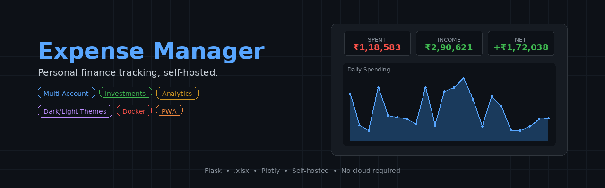

A mobile-friendly personal expense tracker with a Flask backend, `.xlsx` data store, and multi-account support. Features 7 color themes, Plotly charts, investment tracking with live prices, CSRF protection, and full CRUD for transactions.

---

## Screenshots

### Dark Mode

| Dashboard | Analytics |
|:---------:|:---------:|
| 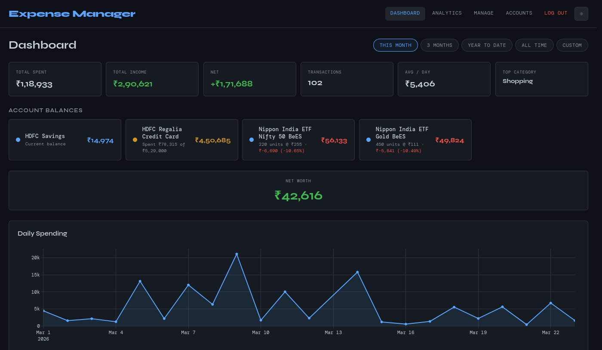 | 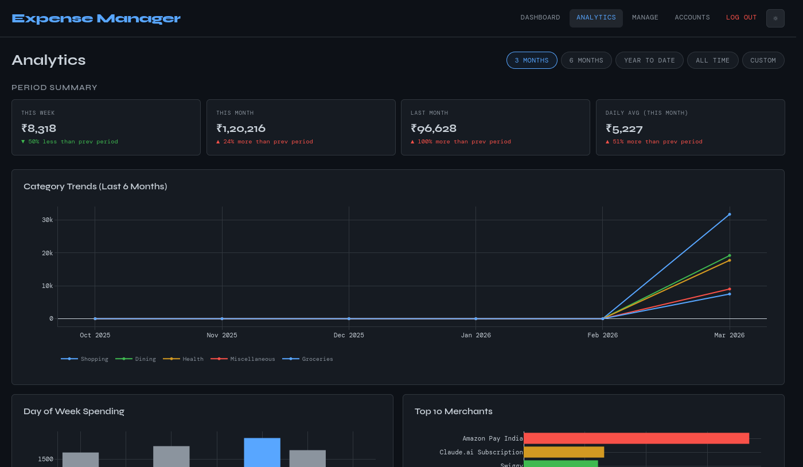 |

| Manage | Accounts |
|:------:|:--------:|
| 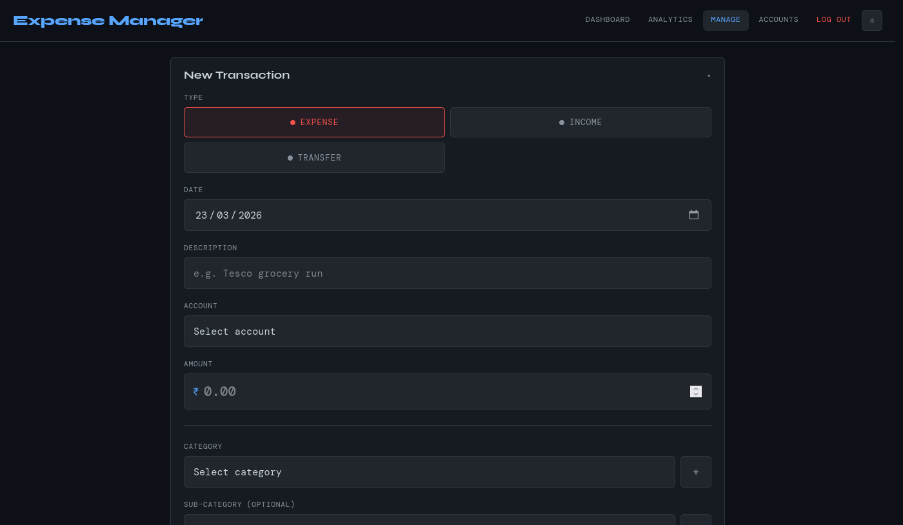 | 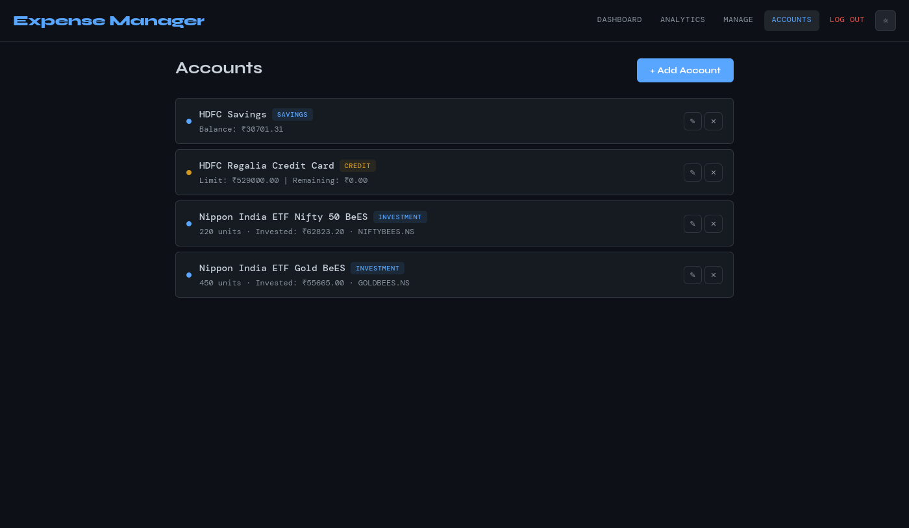 |

### Light Mode

| Dashboard | Analytics |
|:---------:|:---------:|
| 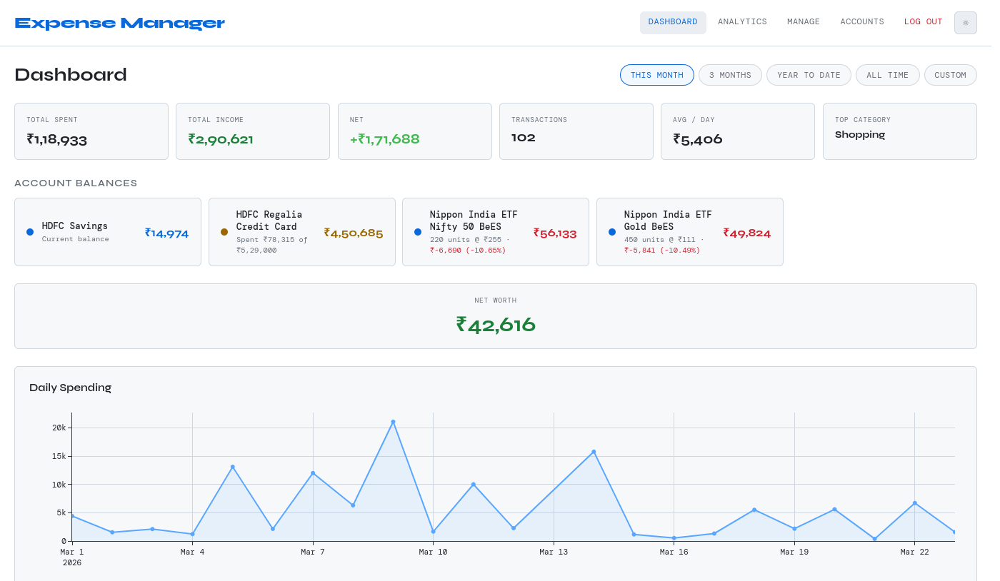 | 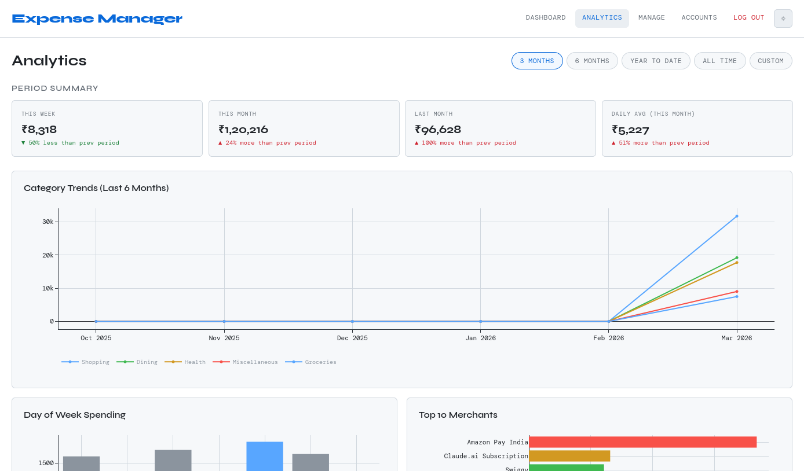 |

### Mobile

| Dashboard | Manage |
|:---------:|:------:|
| 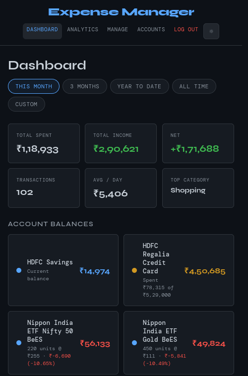 | 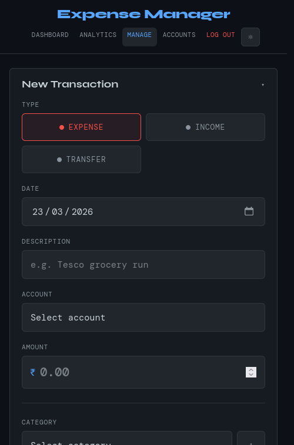 |

### Login

| Dark | Light |
|:----:|:-----:|
| 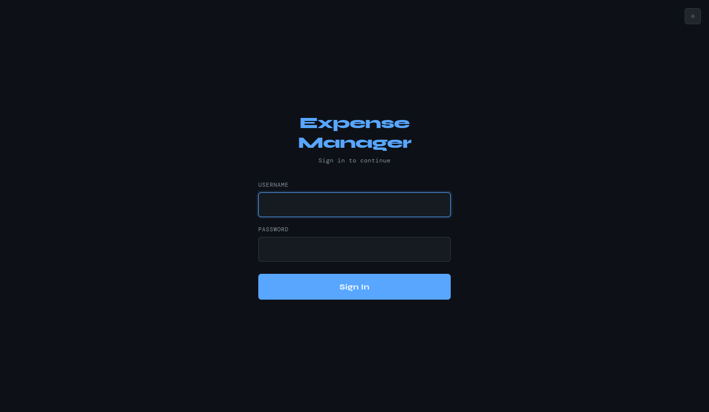 | 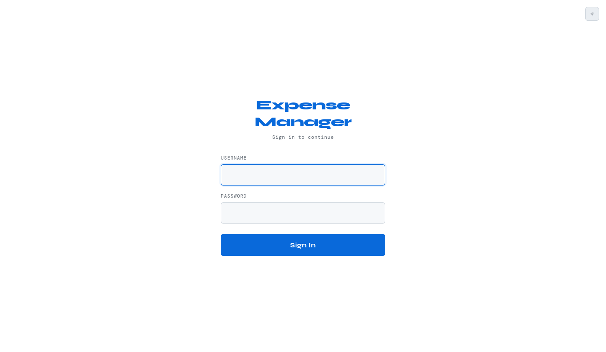 |

---

## Features

- **Multiple account types**: savings, credit cards, and investment accounts (ETFs/stocks + fixed deposits)
- Income, expense, and transfer tracking with per-transaction dashboard tracking toggle
- **Investment portfolio**: live price fetching from Yahoo Finance, P&L tracking, auto-unit updates
- **Fixed deposit tracking**: compound interest calculation, maturity countdown
- **Net worth dashboard**: savings + investments - credit card debt
- Sub-expense support — break down a transaction into individual items via modal
- Category & sub-category management from the frontend
- Dashboard with spending charts, stat cards, account balances, and custom date range filtering
- 7 color themes (GitHub, Indigo, Nord, Emerald, Rose, Amber, Ocean) with dark/light modes
- Login authentication with bcrypt, rate limiting, and CSRF protection
- First-time setup wizard — creates login, accounts, and categories
- **Advanced filtering** — filter transactions by account, type, category, and date range
- **CSV export** — download filtered transactions as CSV
- **Undo delete** — restore accidentally deleted transactions (up to 20 in session)
- **PWA support** — installable on phone home screen, offline caching for static assets
- Mobile-responsive layout with no theme flash on page load
- Transactions sorted by date and ID, grouped by day with day-of-week headers

---

## Pages

| URL | Purpose |
|-----|---------|
| `/` | Redirects to dashboard |
| `/setup` | First-time setup (create login & accounts) |
| `/login` | Sign in |
| `/dashboard` | Charts, stats, account balances, investments & net worth (home page) |
| `/analytics` | Spending trends, category trends, day-of-week patterns, merchant analysis, spending velocity |
| `/manage` | Add transactions + transaction list with edit/delete/track toggle |
| `/accounts` | Manage accounts (savings, credit, investment/ETF, fixed deposits) |

---

## Quick start

### Docker (recommended)

```bash
docker compose up -d
```

### Manual

```bash
pip install -r requirements.txt
python app.py
```

On first launch, open `http://localhost:5000` — the setup wizard will guide you through creating your login and adding accounts.

---

## Data & Backup

All user data lives in the `data/` folder:

| File | Contents |
|------|----------|
| `data/auth.json` | Login credentials (username + bcrypt hash) |
| `data/accounts.json` | Account definitions (savings, credit, investment with tickers/FD details) |
| `data/categories.json` | Category and sub-category definitions |
| `data/expenses.xlsx` | All transaction data |

To migrate or restore: copy the entire `data/` folder to the new install. The app handles an empty or missing `data/` folder gracefully — it will show the setup wizard to start fresh.

The `.env` file holds only server config (host, port, secret key) and is auto-generated during setup if missing.

---

## Investment Tracking

### Market/ETF accounts
- Add an investment account with a **Yahoo Finance ticker** (e.g., `NIFTYBEES.NS`, `GOLDBEES.NS`)
- Enter units held and total invested amount
- Dashboard fetches live prices and shows current value, P&L (amount + percentage)
- When buying new units: add an Income transaction on the investment account with the **units** field — the app auto-updates the account's units and invested amount

### Fixed Deposits
- Add an investment account with subtype **Fixed Deposit**
- Enter principal, interest rate, start date, maturity date, and compounding frequency
- Dashboard calculates current value with compound interest and shows days remaining

### Net Worth
Dashboard shows a net worth card: sum of all savings + investment current values - credit card outstanding.

---

## Resetting credentials

The setup page is only available on first run. To change your login after setup:

1. Generate a new password hash:
   ```bash
   python -c "import bcrypt; print(bcrypt.hashpw(b'newpassword', bcrypt.gensalt()).decode())"
   ```

2. Edit `data/auth.json`:
   ```json
   {
     "username": "newusername",
     "password_hash": "<paste hash here>"
   }
   ```

3. Restart the app.

To start completely fresh, delete the `data/` folder and restart — the setup wizard will appear.

---

## Project structure

```
├── app.py              # Flask routes, auth, API endpoints, investment price fetching
├── spreadsheet.py      # openpyxl read/write, balance computation, formula sanitization
├── requirements.txt
├── Dockerfile
├── docker-compose.yml
├── .env                # Server config (not in git, auto-generated)
├── .github/
│   └── workflows/
│       └── docker.yml  # GitHub Actions — auto-build and push Docker image to ghcr.io
├── data/               # All user data (not in git)
│   ├── auth.json       # Login credentials
│   ├── accounts.json   # Account definitions (savings, credit, investment)
│   ├── categories.json # Category definitions
│   └── expenses.xlsx   # Transaction data
├── scripts/
│   └── take_screenshots.py  # Automated screenshot generator (selenium + geckodriver)
├── screenshots/             # Auto-generated README screenshots
├── static/
│   ├── themes.css      # 7 color palettes (dark + light each)
│   ├── theme.js        # Theme picker logic + localStorage
│   ├── interactions.js # Animated counters, toasts, pull-to-refresh, auto-refresh, PWA SW
│   ├── sw.js           # Service worker (network-first for data, cache-first for static)
│   ├── favicon.svg     # App favicon
│   ├── icon-192.png    # PWA icon
│   └── icon-512.png    # PWA icon
└── templates/
    ├── setup.html      # First-time setup wizard
    ├── login.html      # Login page
    ├── dashboard.html  # Plotly charts, stats, investments & net worth (home page)
    ├── analytics.html  # Spending trends, category analysis, merchant breakdown
    ├── manage.html     # Add transactions + transaction list with sub-expense modal
    └── accounts.html   # Account management (savings, credit, investment, FD)
```

---

## Notes

- Only parent transactions count toward balance calculations — sub-items don't double-count
- Transactions can be toggled as "tracked" or "untracked" — untracked ones still affect account balances but are excluded from dashboard charts and spending totals
- Transaction IDs are global integers across all months
- The `.xlsx` is the single source of truth — you can edit it manually in a spreadsheet app
- `categories.json` and `accounts.json` are updated live from the frontend — no restart needed
- Themes persist across pages via localStorage with no flash of unstyled content
- Investment prices are fetched from Yahoo Finance (free, ~15min delay)
- CC bill payments should be recorded as a Transfer from savings + Income on the CC account

---

## Built with LLM

This project was built using an LLM (Claude). If you want to modify or extend it, feed [`LLM.md`](LLM.md) to your LLM — it contains a detailed implementation guide covering the architecture, data models, API endpoints, theming system, security measures, and common modification patterns.
